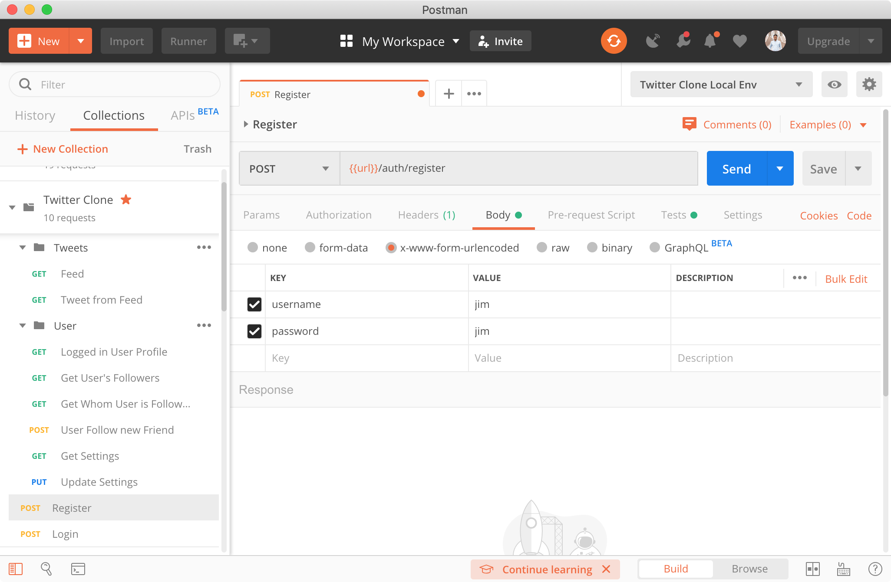

# express-mysql

Code for understanding for creating REST API in Node.js with Express and MySQL.

The article/tutorial can be be read here: https://time2hack.com/2019/09/creating-rest-api-in-node-js-with-express-and-mysql/

You cna run this collection in Postman with following button:

----

Or Download and import in Postman from here: <a href="./Twitter Clone.postman_collection.json" download>Download</a>